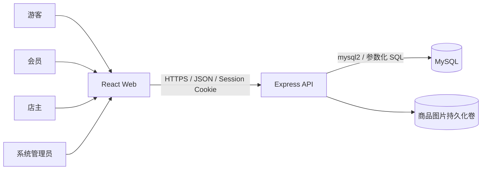
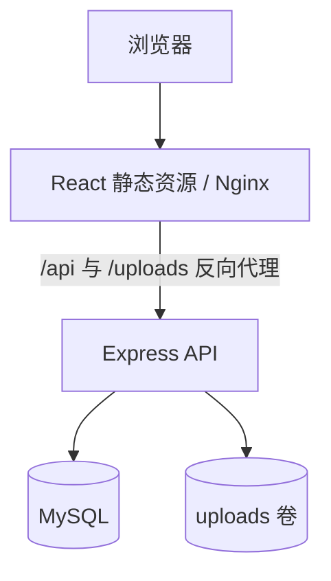
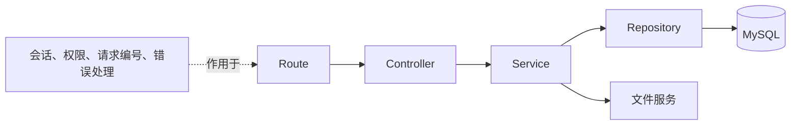
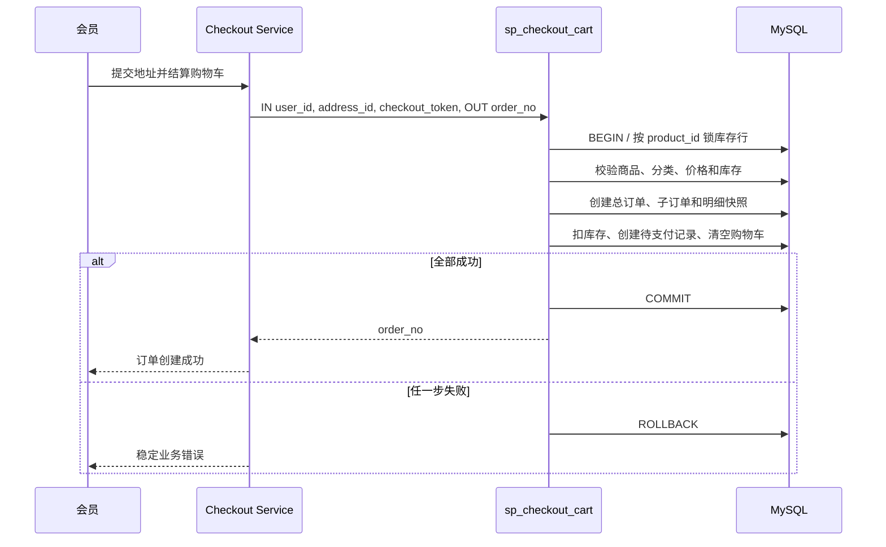
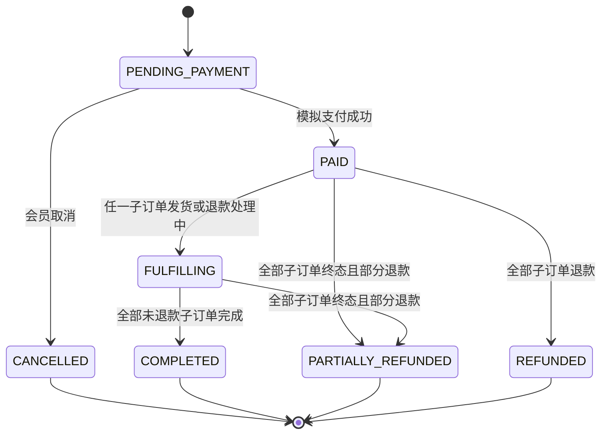
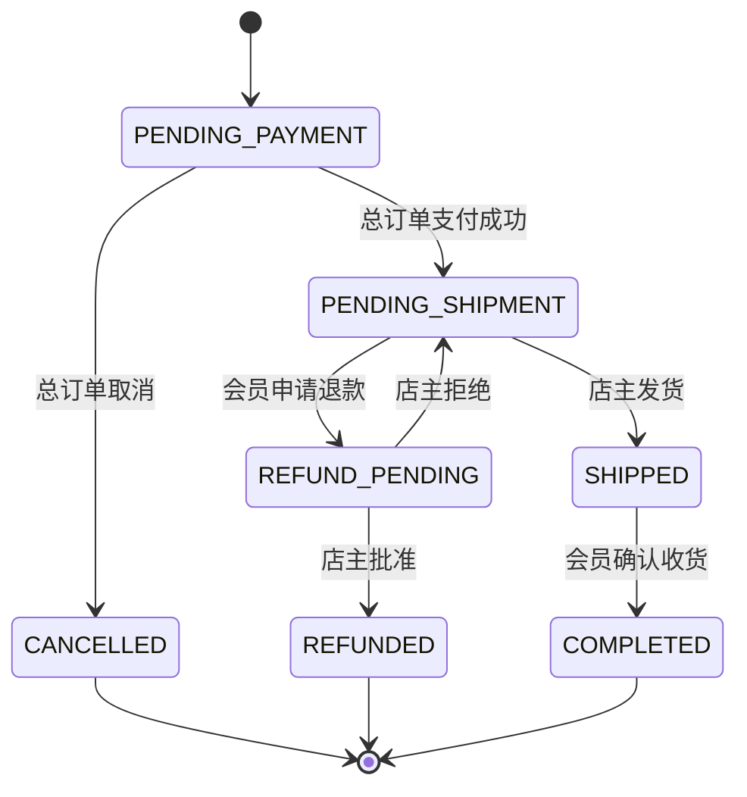

# NovaMall 系统架构设计

## 1. 架构目标

NovaMall 采用 SQL 优先的模块化单体，目标是在保持项目简单可解释的同时，完整展示数据库课程要求。系统不引入微服务和非必要中间件。

## 2. 系统上下文



## 3. 部署架构



Docker Compose 包含前端、后端和 MySQL 三个服务。数据库数据和商品图片分别挂载持久化卷。

## 4. 前端架构

一个 React 工程包含三套桌面端布局：

- 商城布局：面向游客和会员，统一按桌面端设计；
- 店主后台布局：面向共享商品经营管理，统一按桌面端设计；
- 系统后台布局：面向审核、分类、账号和审计，桌面端优先。

按功能组织页面和数据访问，不按文件类型堆积全局目录。前端权限仅用于导航和体验，最终权限由后端决定。

## 5. 后端分层



### Route

- 声明路径、HTTP 方法和中间件；
- 不包含业务规则和 SQL。

### Controller

- 读取已校验的请求参数；
- 调用 Service；
- 转换为统一 HTTP 响应；
- 不直接访问数据库。

### Service

- 执行业务规则、权限归属和状态机；
- 组织事务边界或调用存储过程；
- 不依赖 Express 的 Request/Response 类型。

### Repository

- 应用层唯一允许执行 SQL 的位置；
- 使用 mysql2 参数化查询；
- 将数据库行转换为明确 TypeScript 类型；
- 不决定 HTTP 状态码。

## 6. 后端业务模块

- `auth`：注册、登录、退出和 Session；
- `users`：资料、地址和账号状态；
- `merchant-applications`：开店申请与审核；
- `shops`：店铺资料与归属；
- `categories`：平台分类；
- `products`：商品、库存、图片和价格历史；
- `cart`：购物车；
- `checkout`：统一结算存储过程；
- `orders`：总订单、子订单、发货和确认收货；
- `payments`：模拟支付；
- `refunds`：退款申请与审核；
- `analytics`：销售汇总和 Top 10；
- `audits`：审计查询；
- `uploads`：本地图片上传。

## 7. 关键数据流

### 统一结算



### 模拟支付

支付事务锁定总订单和支付记录，确认订单仍为待支付后，一次性更新支付记录、总订单和全部子订单。重复支付返回原成功结果或冲突，不重复记账。

结算请求携带唯一 `checkout_token`。数据库对该令牌建立唯一约束；同一会员重复提交相同令牌时返回既有订单，避免网络重试造成重复扣库存。

### 退款

退款申请仅针对待发货子订单。批准事务锁定退款、子订单和关联商品，恢复库存后更新退款、子订单及总订单聚合状态。

## 8. 订单状态机

### 总订单



### 店铺子订单



总订单状态由子订单状态聚合。每次迁移均使用“当前状态 + 主键”条件更新，受影响行数为 0 时返回状态冲突。

## 9. 错误处理

统一错误响应：

```json
{
  "success": false,
  "error": {
    "code": "OUT_OF_STOCK",
    "message": "商品库存不足",
    "requestId": "请求编号"
  }
}
```

- 400：参数校验失败；
- 401：未登录或 Session 失效；
- 403：角色或资源归属不允许；
- 404：资源不存在；
- 409：库存不足、重复申请或非法状态迁移；
- 500：未知错误，不暴露 SQL、堆栈和密钥。

存储过程使用稳定业务码表示预期失败。未知数据库错误统一记录请求编号并返回通用错误。

## 10. 视觉方向

品牌采用深海军蓝、星光金和暖白配色。会员商城突出商品与搜索；后台界面强调信息密度、状态和可操作性。动画只用于状态反馈和页面过渡，并尊重减少动态效果设置。

## 11. 关键取舍

- 选择模块化单体而非微服务：业务规模有限，事务一致性更重要。
- 选择 mysql2 而非 ORM：需要直接展示高级 SQL 和执行计划。
- 选择服务端 Session 而非前端存 JWT：权限变更和退出立即生效。
- 选择本地图片卷而非对象存储：离线课程演示更稳定。
- 选择整单退款而非完整售后：形成闭环但控制范围。
